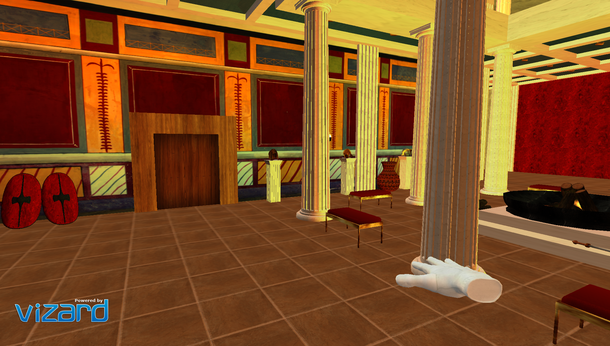
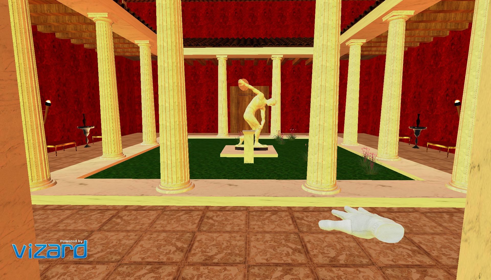
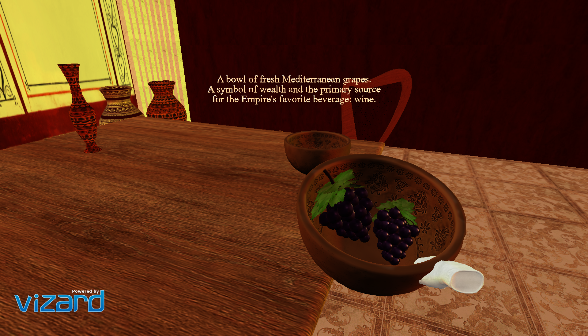
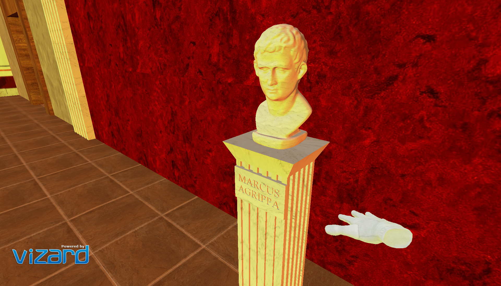

# Roman Villa VR

An interactive virtual reality reconstruction of a Roman villa, developed with WorldViz Vizard and Autodesk 3ds Max.

The project was designed primarily for the HTC Vive through SteamVR, but it can also run without a VR headset in desktop mode using a keyboard and mouse.

## Preview

<p align="center">
  
  
</p>

<p align="center">
  
  
</p>

## Overview

Roman Villa VR is an interactive 3D environment inspired by Roman domestic architecture and material culture.

Users can explore the villa, interact with artifacts, open doors, examine objects, listen to environmental audio, and move between different levels of the building.

The project was originally developed as a university assignment focused on:

- Virtual reality
- Cultural heritage
- 3D reconstruction
- Interaction design
- Spatial audio
- Historical visualization

## Features

- HTC Vive support through SteamVR
- Desktop mode without a VR headset
- Interactive exploration of a Roman villa
- Grabbable artifacts and household objects
- Descriptions displayed when selected objects are picked up
- Interactive doors
- Movement between the ground and upper floors
- Positional ambient audio
- Footstep sounds
- Dynamic torch and fire effects
- Skybox environment
- Separate desktop and VR configurations

## Interactive Objects

The environment contains several interactive objects and artifacts, including:

- Amphorae
- Roman helmets
- Gladius
- Harps
- Vases
- Statues
- Bowls and household objects
- Decorative objects
- Food-related objects

Some artifacts display short historical or contextual descriptions when they are picked up.

## Technologies

- Python
- WorldViz Vizard 8
- Autodesk 3ds Max
- SteamVR
- HTC Vive
- glTF 2.0
- OpenSceneGraph
- Virtual reality interaction
- Spatial audio
- 3D environment design

## Project Structure

```text
RomanVillaVR/
├── src/
│   ├── Roman Villa Final.py
│   ├── vizconnect_config.py
│   └── headset_config.py
├── exported/
│   ├── Roman Villa.gltf
│   ├── Roman Villa.bin
│   ├── textures
│   ├── audio files
│   └── skybox images
├── media/
│   ├── Atrium.png
│   ├── Agrippa.png
│   ├── Items.png
│   └── Peristylium.png
├── docs/
│   └── ATTRIBUTION.md
├── LICENSE
└── README.md
```

## Requirements

### Desktop Mode

- Windows
- WorldViz Vizard 8
- Keyboard and mouse

### VR Mode

- Windows
- WorldViz Vizard 8
- SteamVR
- HTC Vive or a compatible SteamVR headset
- SteamVR-compatible controllers

A VR headset is not required to run the project.

## Running the Project

Clone the repository:

```bash
git clone git@github.com:AndreasBelias/RomanVillaVR.git
```

Open WorldViz Vizard and load:

```text
src/Roman Villa Final.py
```

Run the script from the Vizard IDE.

The script automatically resolves the runtime assets from the `exported/` directory.

## Desktop Mode

Desktop mode is enabled by default.

The project uses:

```python
vizconnect.go(require_file(script_path('vizconnect_config.py')))
movement_tracker = vizconnect.getTracker(
    'mouse_and_keyboard_walking'
).getNode3d()
```

This allows the environment to run without a VR headset.

### Desktop Controls

- Keyboard and mouse: movement and camera control
- Left mouse button: grab or interact
- `U`: move to the upper floor
- `J`: return to the ground floor
- Spacebar: enable the headlight

Exact controls may depend on the active Vizard configuration.

## HTC Vive and SteamVR Mode

The project was originally designed for the HTC Vive using SteamVR.

To run the project in VR:

1. Connect the HTC Vive headset.
2. Start SteamVR.
3. Confirm that the headset and controllers are detected.
4. Open the project in WorldViz Vizard.
5. Enable the VR configuration in the main script.

Replace the desktop configuration:

```python
vizconnect.go(require_file(script_path('vizconnect_config.py')))
movement_tracker = vizconnect.getTracker(
    'mouse_and_keyboard_walking'
).getNode3d()
```

with the headset configuration:

```python
vizconnect.go(require_file(script_path('headset_config.py')))
movement_tracker = vizconnect.getTracker(
    'head_tracker'
).getNode3d()
```

The exact tracker names may depend on the current `headset_config.py` configuration and the connected SteamVR hardware.

## Model Loading

The main environment is loaded from:

```text
exported/Roman Villa.gltf
```

The glTF file depends on:

```text
exported/Roman Villa.bin
```

and on the textures stored in the same `exported/` directory.

The `.gltf`, `.bin`, textures, and referenced media files should remain together.

Do not move the model files independently unless the paths inside the glTF file are also updated.

## Audio

The project includes environmental and interaction audio such as:

```text
bird sound.wav
footsteps.wav
```

Some audio files are treated as optional, allowing the project to continue running even if a sound file is unavailable.

## Skybox

The skybox uses six cubemap textures:

```text
sunset_posx.jpg
sunset_negx.jpg
sunset_posy.jpg
sunset_negy.jpg
sunset_posz.jpg
sunset_negz.jpg
```

These files must remain inside the `exported/` directory.

## Troubleshooting

### glTF or GLB models fail to load

If Vizard reports:

```text
Failed to load model
```

even for a known-valid `.gltf` or `.glb` file, check whether Windows Smart App Control, Windows Security, or another security feature has blocked components of the Vizard installation.

Before modifying the model, test Vizard with a small known-valid GLB file.

In this project, Windows Smart App Control prevented Vizard from loading glTF and GLB models even though the main Vizard application still opened normally.

### Missing textures

Make sure that all textures referenced by `Roman Villa.gltf` remain inside the `exported/` directory.

Moving or renaming texture files may cause the model to load without materials or fail to load correctly.

### Missing audio

Make sure the required `.wav` files remain inside the `exported/` directory.

The project may continue running without some optional audio files.

### SteamVR headset is not detected

Check that:

- SteamVR is running
- The HTC Vive headset is connected
- The controllers are detected
- The correct Vizard headset configuration is enabled
- The tracker names in `headset_config.py` match the connected hardware

### Large repository size

The repository contains a large binary model file:

```text
exported/Roman Villa.bin
```

Cloning the repository may take some time depending on the connection speed.

Frequent commits of large binary exports should be avoided because each version increases the total Git history size.

## Development Notes

The Python code manages:

- Environment loading
- Desktop and VR configurations
- HTC Vive and SteamVR interaction
- Object grabbing
- Artifact descriptions
- Door interaction
- Positional audio
- Footstep playback
- Dynamic fire and torch lighting
- Floor movement
- Runtime asset paths

The 3D environment was created and prepared in Autodesk 3ds Max and exported as glTF for use in WorldViz Vizard.

## Historical and Educational Context

The project presents a historically inspired Roman domestic environment.

It is intended as an educational and interactive visualization rather than a fully authoritative archaeological reconstruction.

The villa includes architectural spaces, decorative elements, furniture, artifacts, and household objects inspired by Roman material culture.

## Attribution

Some models, textures, images, and audio assets may originate from third-party sources.

See `docs/ATTRIBUTION.md` for available attribution and licensing information.

## License

The source code is licensed under the MIT License.

Third-party models, textures, images, audio files, and other media remain subject to their original licenses.

See `docs/ATTRIBUTION.md` for more information.

## Author

**Andreas Belias**

Undergraduate student in Informatics and Telecommunications, with interests in:

- Computer vision
- Virtual reality
- Robotics
- Interactive systems
- Scientific computing
- 3D visualization
